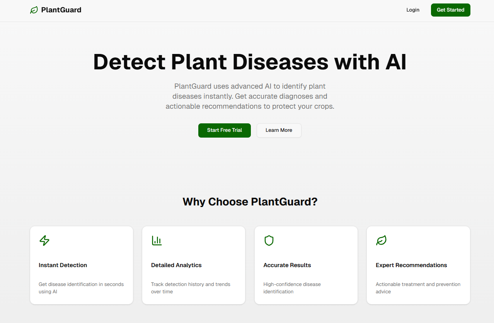
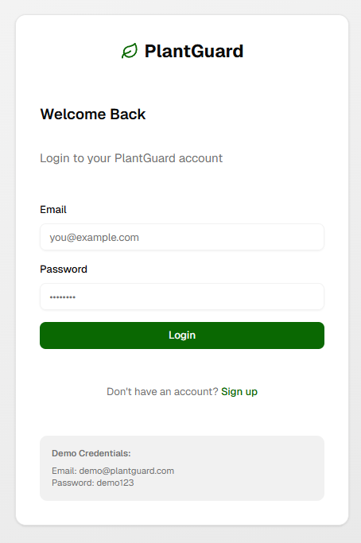
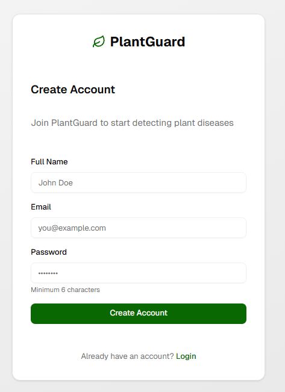
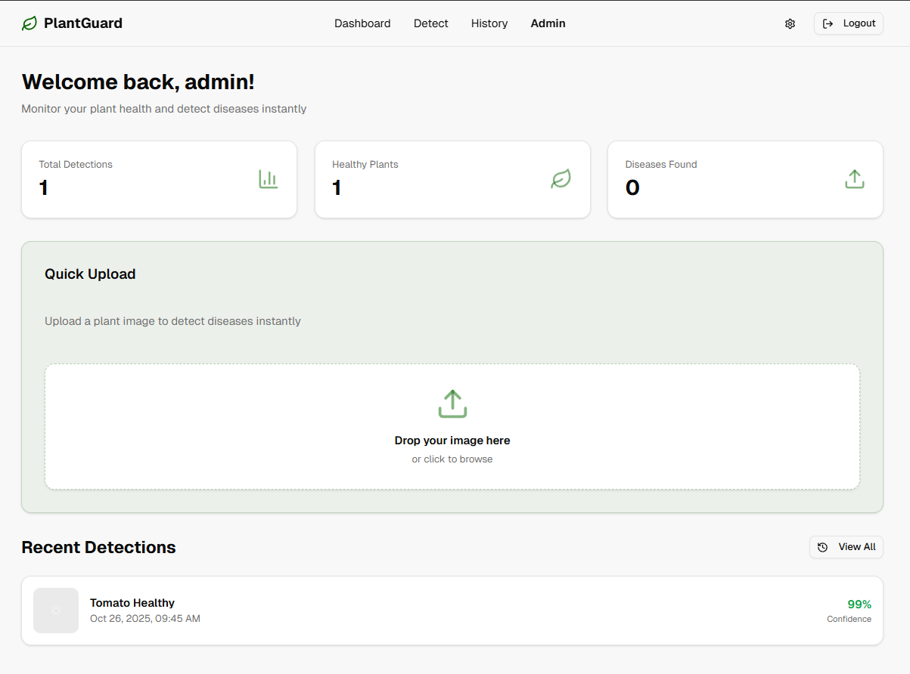
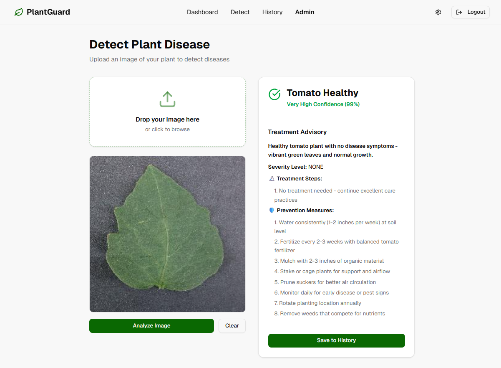
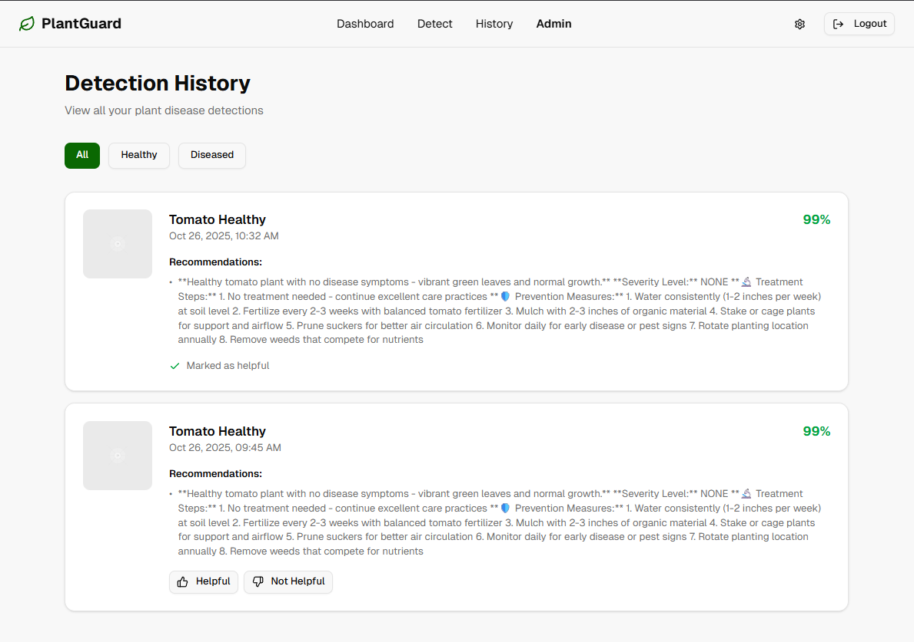
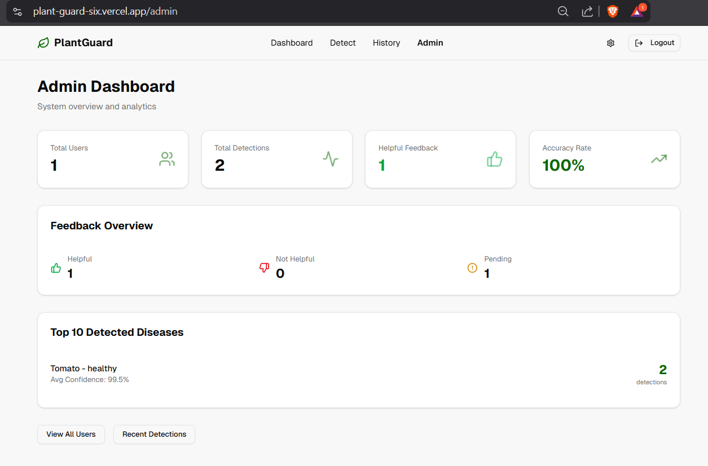
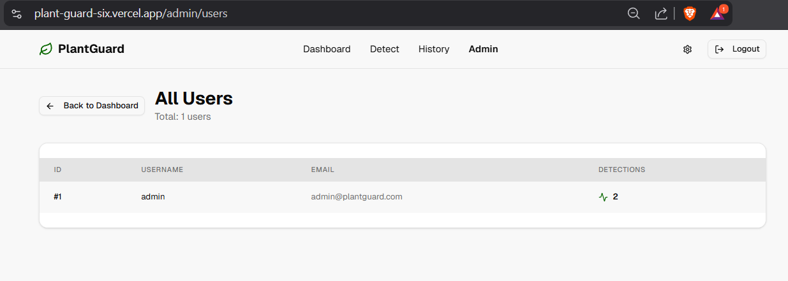
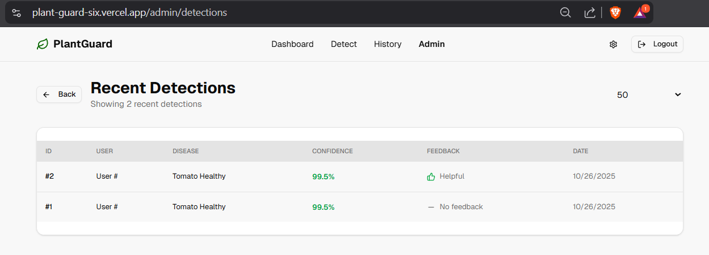

# PlantGuard - AI-Powered Plant Disease Detection
#  PlantGuard - AI-Powered Plant Disease Detection

**PlantGuard** is an advanced AI web application that detects plant diseases with **99.82% training accuracy** using a state-of-the-art **Vision Transformer (ViT)** model. It provides instant diagnosis and treatment recommendations for **38 different plant disease classes**.  

---

## Live Demo & Services

| Service       | URL                                                                 | Status |
|---------------|---------------------------------------------------------------------|--------|
| Frontend      | [https://plant-guard-six.vercel.app](https://plant-guard-six.vercel.app) | 🟢 Live |
| Backend API   | [https://rushikatabathuni-plantguard-backend.hf.space](https://rushikatabathuni-plantguard-backend.hf.space) | 🟢 Live |
| Model Hub     | [Hugging Face Model](https://huggingface.co/rushikatabathuni/plantguard-vit) | 🟢 Live |

---

##  Key Features

- **High-Accuracy Detection:** 99.82% training accuracy (~98.5% validation).  
- **38 Disease Classes:** Covers Tomato, Apple, Corn, Grape, Potato, and more.  
- **Real-Time Inference:** Fast predictions (1–2 seconds on CPU).  
- **Responsive UI:** Mobile-friendly interface built with **Next.js** & **shadcn/ui**.  
- **User Authentication:** Secure JWT-based authentication.  
- **Detection History:** Track and review past diagnoses.  
- **Treatment Advisory:** Comprehensive treatment recommendations.  

---

## 💻 Technology Stack

| Area              | Technologies |
|------------------|------------------------------------------------|
| Frontend          | Next.js 16, React 19, TypeScript, Tailwind CSS, shadcn/ui, Vercel |
| Backend           | FastAPI, Python 3.12, SQLAlchemy, SQLite, JWT, HuggingFace Spaces |
| Machine Learning  | PyTorch, Hugging Face Transformers (ViT), PlantVillage Dataset |

---

## Installation & Local Setup

### Prerequisites

- Node.js 22.x  
- Python 3.12.x  
- Git  

### Steps

1. **Clone Repository**
```bash
git clone https://github.com/rushikatabathuni/plantguard.git
cd plantguard
```
2. **Backend Setup**
``` # Navigate to backend directory
cd backend

# Create and activate virtual environment
python -m venv venv
source venv/bin/activate  # On macOS/Linux
# venv\Scripts\activate   # On Windows

# Install dependencies
pip install -r requirements.txt

# Run FastAPI server
uvicorn main:app --reload --host 0.0.0.0 --port 8000
```
3. **Frontend Setup** 
```# Navigate to frontend directory (from root)
cd frontend

# Install dependencies
npm install --legacy-peer-deps

# Create environment file
echo "NEXT_PUBLIC_API_URL=http://localhost:8000" > .env.local

# Run development server
npm run dev
```
## 🛠 API Endpoints

| Method | Endpoint           | Description                                      | Auth Required |
|--------|------------------|--------------------------------------------------|---------------|
| POST   | /auth/register    | Create a new user                                | ❌ No        |
| POST   | /auth/login       | Authenticate and receive a JWT token            | ❌ No        |
| POST   | /detect           | Upload an image for disease detection           | ✅ Yes       |
| GET    | /history          | Get the user's detection history                | ✅ Yes       |
| GET    | /health           | Check the health of the API                     | ❌ No        |

---










